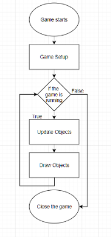
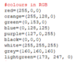
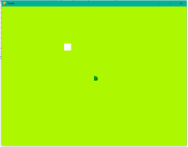
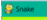
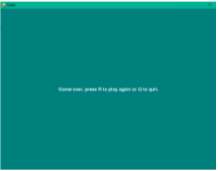
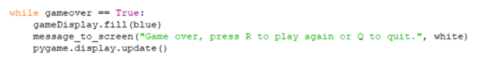
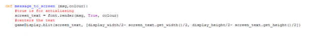
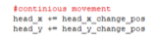

Snake Game

Python

For the python implementation I decided to create a snake game. This proved quite challenging and some code was quite difficult. 
The Structure (Algorithm) for the game loop:

Getting started
The project began by defining a list of colours and setting the RGB digits to their names as you can see below. 

Then the display height was set to 800x600 this is because most modern devices are able to run this resolution however 
all the variables have been to names,

this would make it easier to edit the game for other resolutions instead of changing 
100’s of variables you can change the set variables for the names such as “block_size = 20” if I where to change the 20 to 40 
everywhere with the code that has “block_size” would change to 40” without this all of the “20” integers would have to be changed 
one by one. The window name was set to snake using this code” pygame.display.set_caption("Snake") ” as can be seen here.

 
The background colour was then set using this code “gameDisplay.fill(lightgreen)” as stated above the colours have been defined already. 

The game over screen 

was done using this code: 

The game over screen would happen if the snake collides with itself or if it exits the window boundaries and the user has the option to replay 
or exit. It was fairly simple and basic however it done what was necessary. The font was defined using this code ” font = pygame.font.SysFont(None, 25) ”. 
The text was defined in a function as seen below:

Bugs
Then there was the problem where the snake’s movement was not constant this was fixed by adding a simple 2 layers of code :  

Furthermore, there was the problem that the game wouldn’t end/ display the end screen unless a KEYDOWN was pressed this was fixed using this code :
    
An unexpected problem I had came across was that the spire head “snakehead” would not rotate upon the user’s movement if the user decided to go NORTH,
SOUTH or WEST the snake head would still look the EASTERN direction. This made the game a little wonky however would not affect the gameplay other than
confuse the user perhaps. Due to lack of time I was unable to resolve this issue however I would assume that along with KEYPRESSED I would be able to set
the image rotations at a certain degree that would fit the direction the user had chosen. However, the final problem was something I had not noticed until 
it was too late. Using “import time“ the fps for the game was able to be set however due to lack of time I was unable to change the fps to “30” from “15” as
the snake would be too fast for the user to play the game as intended.  The way this would have done this by setting “FPS” to “30” then changing the “block_size”
to “10” however as the sprite was set to a pixel size of “20 x 20” this made the snake head seem bigger than the collision would detect this could have been altered 
with more time. However, on the bright side this created a less need for processing power.
